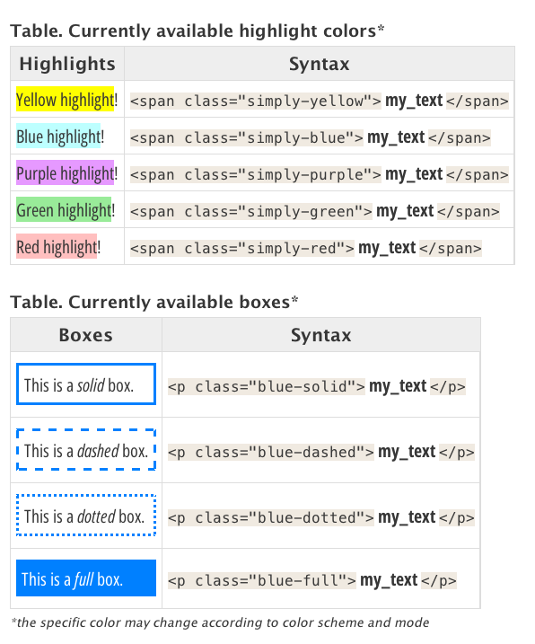

# SimplyClassyCSS

A collection of beautiful and classy CSS styles suitable for simple renderers such as Java Swing's. Website: [https://i-plasm.github.io/simply-classy-css](https://i-plasm.github.io/simply-classy-css)

## Features

- Beauty
- Readability
- Fonts chosen for the best displays in Java Swing
- Variety of styles and color schemes. Light and dark modes
- Extra 1: special tag classes for highlighting and emphasizing text
- Extra 2: groovy scripts for automatic highlighting/emphasizing

## Usage

_SimplyClassyCSS_ features different styles (e.g "Spacious").

For each style, different color schemes may be supported (e.g "Standard", "Gruvbox").

For each color scheme, light or dark mode (or both) are supported.

### Set-up

1. Check out the [Gallery](https://i-plasm.github.io/simply-classy-css/site/gallery.html) and select your preferred CSS. Download it.
1. Configure your software/environment to use that CSS.
1. Check the required fonts listed in the screenshot and install any missing ones. All fonts are free Google fonts, and can be obtained from: [https://fonts.google.com/](https://fonts.google.com/).
1. After installing the fonts, restart the software where you will be using the CSS.

### Styled Paragraphs and Sections

When using any of the __SimplyClassyCSS__ styles, text inside special `` tags becomes highlighted. Additionally, special `
` tags draw styled boxes around your paragraphs. Very useful for studying, analyzing or creating emphasis on texts. The syntax is:

#### Extra: Automatic styling scripts

The groovy scripts [**SpanHighlighter**](scripts/spanHighlighter.groovy) and [**BoxedParagraph**](scripts/boxedParagraph.groovy) wrap selected text in a `JTextComponent` (Java Swing) with the desired syntax.

To use in freeplane: after setting up the CSS style, install the scripts, select the text you’d like to emphasize, and call the desired script: the appropriate tags will be inserted automatically. A brief explanation on how to use each script:

__Freeplane Tip!__ You can use the [**SpanHighlighter**](scripts/spanHighlighter.groovy) script to ___automatically surround the text you'd like to highlight___ with `my_text`. The default is yellow. You can change the color simply by changing the `class` attribute. The script gets installed in the menu `Format -> Highlight -> Span Highlighter`. _Suggestion: for quick access, assign the `ctrl + shift + L` shortcut to the script_. [CLICK HERE FOR THE FULL GUIDE](https://ideaplasm.com/2023/09/29/freeplane-highlighting-emphasizing)

__Freeplane Tip!__ You can use the [**BoxedParagraph**](scripts/boxedParagraph.groovy) script to ___automatically surround the paragraph you'd like to enclose in a box___ with `
my_paragraph
`. The default is dotted box. You can change it by modifying the `class` attribute.  The script gets installed in the menu `Format -> Highlight -> Boxed Paragraph`. _Suggestion: for quick access, assign the `ctrl + shift + P` shortcut to the script_. [CLICK HERE FOR THE FULL GUIDE](https://ideaplasm.com/2023/09/29/freeplane-highlighting-emphasizing)

## Screenshots

__Check the complete Gallery at <a href="https://i-plasm.github.io/simply-classy-css/site/gallery.html">the SimplyClassyCSS website</a>__

## License

SimplyClassyCSS materials, except logos and otherwise noted, are licensed under a BSD-3-Clause license. See [LICENSE](LICENSE) and [third-party-licenses](third-party-licenses.txt).
